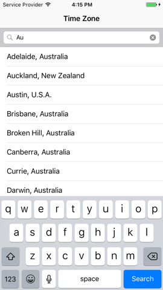
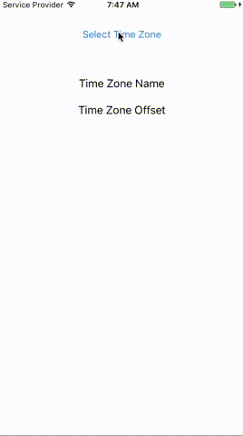

# TimeZonePicker

[](https://travis-ci.org/gligorkot/TimeZonePicker)
[](https://codebeat.co/projects/github-com-gligorkot-timezonepicker-master)
[](http://cocoadocs.org/docsets/TimeZonePicker)
[](http://cocoadocs.org/docsets/TimeZonePicker)
[](http://cocoadocs.org/docsets/TimeZonePicker)

A TimeZonePicker UIViewController similar to the iOS Settings app. Search and select from a range of cities and countries to find your most suitable time zone.

## Screenshots




## Installation

### CocoaPods

To install it in your iOS project, install with [CocoaPods](http://cocoapods.org)

```ruby
pod 'TimeZonePicker'
```

## Usage

### Basic Initialisation

To initialise a `timeZonePicker` you can use the class function `getVC(withDelegate: TimeZonePickerDelegate)` on the `TimeZonePickerViewController` as below:

```swift
let timeZonePicker = TimeZonePickerViewController.getVC(withDelegate: self)
```

Then you can use the `timeZonePicker` as you would any `UIViewController`, for example:

```swift
present(timeZonePicker, animated: true, completion: nil)
```

### TimeZonePickerDelegate

The `TimeZonePickerDelegate` currently has only one method that needs to be implemented:

```swift
func timeZonePicker(_ timeZonePicker: TimeZonePickerViewController, didSelectTimeZone timeZone: TimeZone)
```

Once an item is selected from the table of cities/countries the above delegate method gets called, conveniently returning the `TimeZonePickerViewController` and the selected `TimeZone`. You can use the `timeZonePicker` to dismiss it here and the `timeZone` as you need it in your application. For example:

```swift
func timeZonePicker(_ timeZonePicker: TimeZonePickerViewController, didSelectTimeZone timeZone: TimeZone) {
    timeZoneName.text = timeZone.identifier
    timeZoneOffset.text = timeZone.abbreviation()
    timeZonePicker.dismiss(animated: true, completion: nil)
}
```

Please check the `TimeZonePickerExample` project for the above usage example. If you have any questions do not hesitate to get in touch with me.

## Requirements

* iOS 8 or later.
* Swift 3

## License
    Copyright (c) 2017 Gligor Kotushevski

    Licensed under the Apache License, Version 2.0 (the "License");
    you may not use this file except in compliance with the License.
    You may obtain a copy of the License at

       http://www.apache.org/licenses/LICENSE-2.0

    Unless required by applicable law or agreed to in writing, software
    distributed under the License is distributed on an "AS IS" BASIS,
    WITHOUT WARRANTIES OR CONDITIONS OF ANY KIND, either express or implied.
    See the License for the specific language governing permissions and
    limitations under the License.
